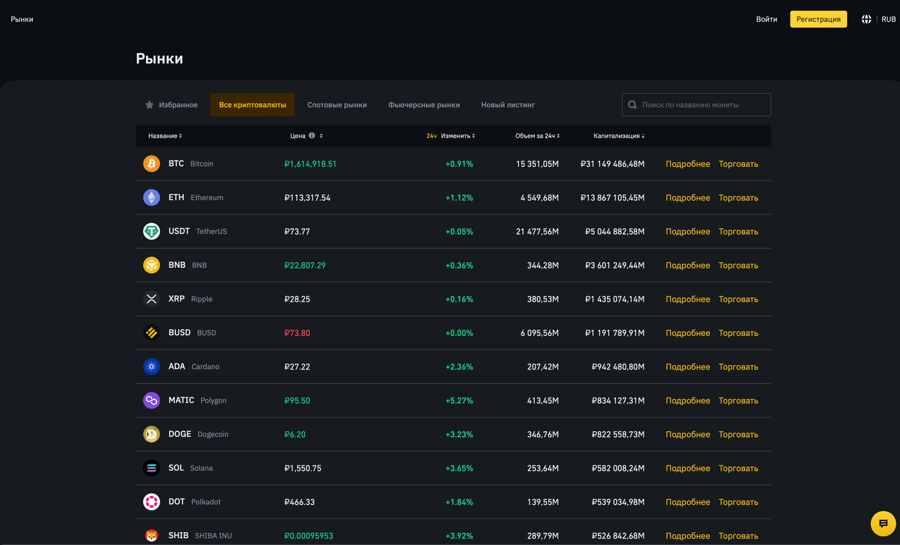
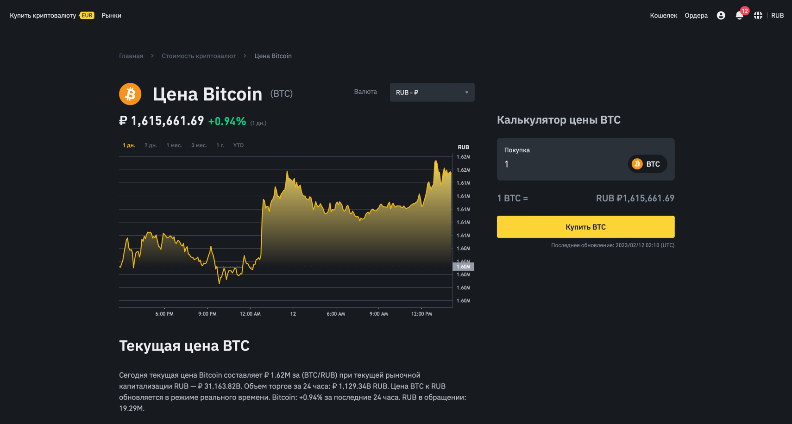
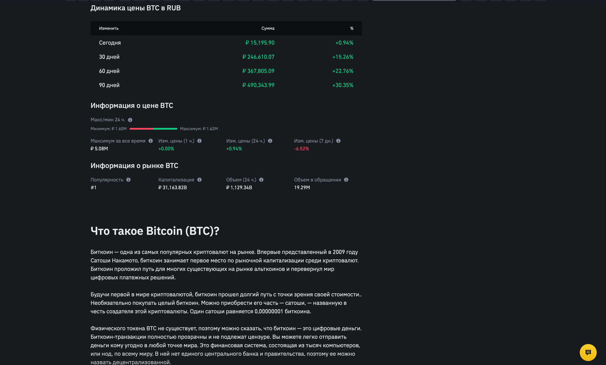
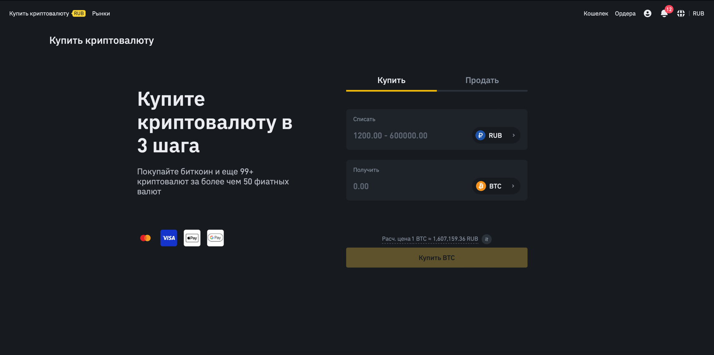
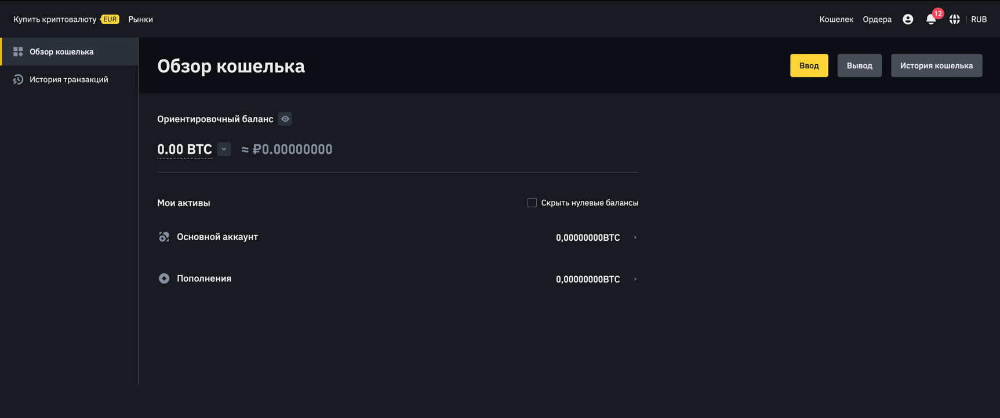
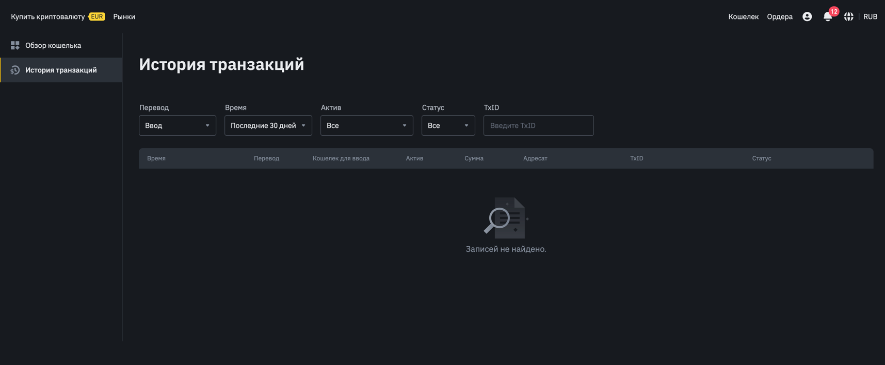

# crypto-exchange

Торговое ядро – важнейшая часть криптовалютной биржи. От того, насколько функциональным является его код, зависит скорость и корректность выполнения всех операций на бирже.

Ядро выполняет несколько приоритетных задач:

проверяет все выставляемые ордера на обеспеченность финансовыми активами. Проще говоря, в зависимости от текущего баланса трейдера позволяет или не позволяет выставить ему ордер на покупку/продажу криптовалюты;
создает и изменяет записи в базе данных при выставлении новых ордеров и исполнении текущих;
подготавливает данные для отображения в торговом терминале – текущие уровни цен, значения для графиков и биржевых стаканов, список последних исполненных ордеров и так далее.
Крайне важно, чтобы выполнение всех этих функций проводилось в несколько потоков. В этом случае биржа будет справляться с обработкой всех поступающих ордеров даже при автоматической торговле с использованием ботов. Разделение функций может проводиться как виртуально (отдельные процессы для разных задач), так и физически (разные серверы в составе одной локальной сети).

// TODO

Централизованная криптовалютная биржа

Криптобиржи во многом похожи на брокерские платформы, и каждая из них предлагает портал, на котором вы можете создавать 
различные типы ордеров на покупку, продажу и спекуляцию криптовалютами с другими пользователями.

Ядро криптовалютной биржи:
* проверяет все выставляемые ордера на обеспеченность финансовыми активами. Проще говоря, в зависимости от текущего 
баланса трейдера позволяет или не позволяет выставить ему ордер на покупку/продажу криптовалюты;
* создает и изменяет записи в базе данных при выставлении новых ордеров и исполнении текущих;
* подготавливает данные для отображения в торговом терминале – текущие уровни цен, значения для графиков и биржевых 
стаканов, список последних исполненных ордеров и так далее.

Выставление и исполнение ордеров на бирже происходит так быстро потому, что при каждой операции деньги не переносятся 
с кошелька на кошелек, а лишь делается соответствующая запись в базе данных. Непосредственный перевод фиатных денег 
или криптовалюты происходит только при пополнении баланса и выводе средств.

## Визуальная схема фронтенда

Просмотр рынка всех криптовалют

Подробная информация про криптовалюту

Биржевая торговля

Прямая покупка и продажа криптовалюты

Пополнение и вывод средств - виртуальный счет

История транзакций

## Документация

1. Маркетинг
    1. [Заинтересанты](./docs/marketing/stakeholders.md)
    2. [Целевая аудитория](./docs/marketing/target-audience.md)
    3. [Конкурентный анализ](./docs/marketing/concurrency.md)
    4. [Анализ экономики](./docs/marketing/economy.md)
    5. [Пользовательские истории](./docs/marketing/user-stories.md)
2. DevOps
    1. [Схема инфраструктуры](./docs/devops/infrastruture.md)
    2. [Схема мониторинга](./docs/devops/monitoring.md)
3. Тесты
4. Архитектура
    1. [Компонентная схема](./docs/architecture/architecture.md)
    2. [Интеграционная схема](./docs/architecture/integration.md)
    3. [Описание API](./docs/architecture/api.md)
    4. [Модель данных](./docs/architecture/data-model.md)